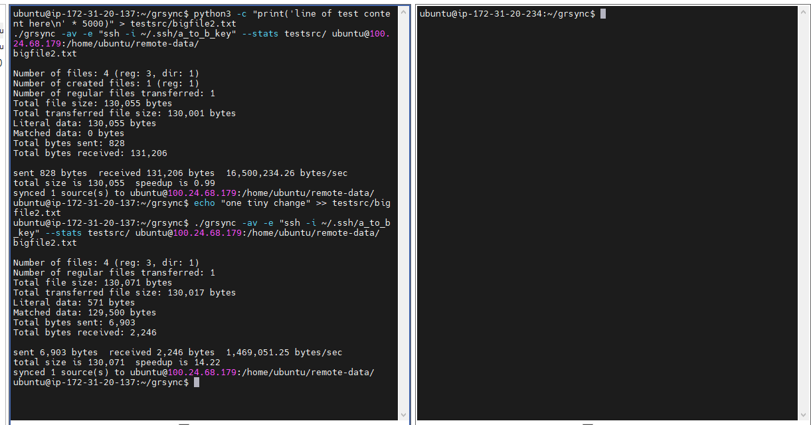
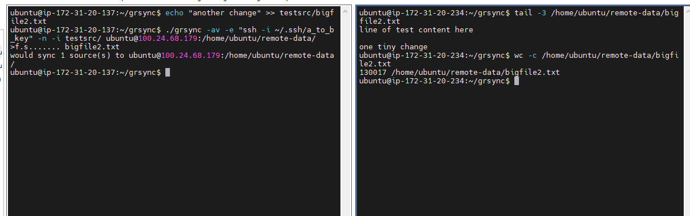
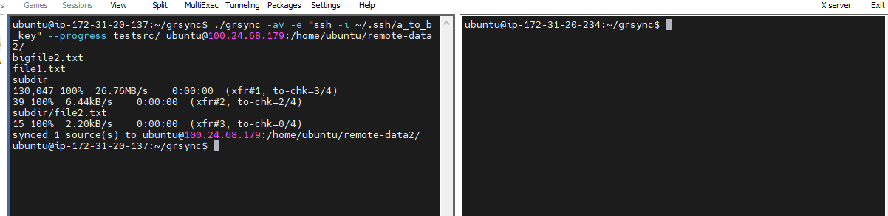
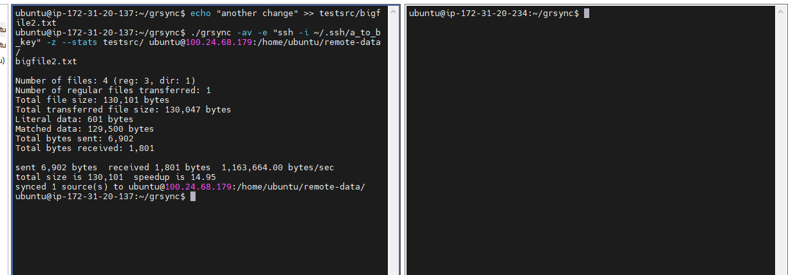
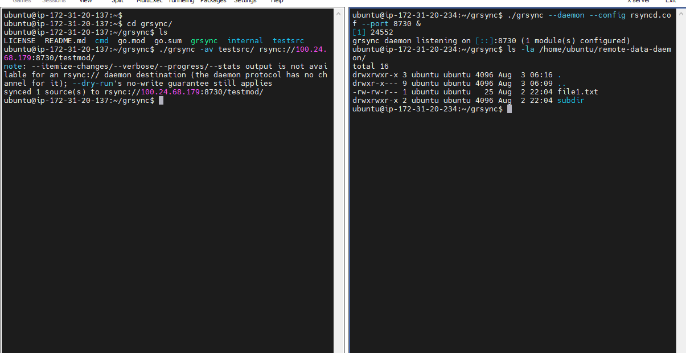

# grsync

grsync is a rewrite of [rsync](https://github.com/RsyncProject/rsync) in Go,
aiming for full feature parity with the original C implementation: the
delta-transfer algorithm, SSH and daemon transport, filtering, file
attribute preservation, and the major CLI flags.

## Status

grsync can sync files today, locally, over SSH, and to/from an `rsync://`
daemon: `grsync SRC... DEST` walks the source, applies filters, computes a
delta against the destination, transfers only what changed, and restores
requested attributes.

Two things worth knowing up front:

- **grsync does not speak real rsync's wire protocol.** Its own
  network/transfer format is a simple Go-specific encoding, not upstream
  rsync's binary protocol. That means a grsync client can only sync with a
  grsync server (or daemon) - not with the real `rsync` binary - and a
  grsync batch file can't be read by real rsync either. The daemon's
  *handshake and authentication* are real-protocol-compatible (see
  [Daemon Mode](#daemon-mode)); only the transfer itself is not.
- **`--delete` isn't implemented**, and device/special files are only
  partially supported (see [Limitations](#limitations)).

## Build

```sh
go build ./cmd/grsync
```

Or run directly:

```sh
go run ./cmd/grsync <source>... <destination> [flags]
```

## Usage

```
grsync <source>... <destination> [flags]
```

At least one source and exactly one destination are required; the last
argument is always the destination.

Flags are grouped the same way `grsync --help` groups them.

**Core**

| Flag | Short | Description |
|---|---|---|
| `--archive` | `-a` | archive mode: `-rlptgo` (see below) |
| `--verbose` | `-v` | print each updated item's path |
| `--dry-run` | `-n` | plan the sync without changing anything on disk |
| `--recursive` | `-r` | recurse into directories |
| `--dirs` | `-d` | list directories without recursing into them (implied by `-r`) |

**Attributes** (what `--archive` bundles)

| Flag | Short | Description |
|---|---|---|
| `--perms` | `-p` | preserve permissions |
| `--times` | `-t` | preserve modification times |
| `--owner` | `-o` | preserve owner (needs privileges on most systems) |
| `--group` | `-g` | preserve group (needs privileges on most systems) |
| `--links` | `-l` | recreate symlinks as symlinks |
| `--hard-links` | `-H` | preserve hard links (not implied by `--archive`, same as real rsync) |

**Filtering**

| Flag | Description |
|---|---|
| `--exclude PATTERN` | exclude matching files (repeatable) |
| `--include PATTERN` | include matching files (repeatable) |
| `--filter RULE` | add a raw filter rule (repeatable) |
| `--exclude-from FILE` | read exclude patterns from FILE (repeatable) |
| `--include-from FILE` | read include patterns from FILE (repeatable) |

**Output**

| Flag | Short | Description |
|---|---|---|
| `--itemize-changes` | `-i` | print a per-item change summary, rsync's `%i` format (takes precedence over `-v`) |
| `--progress` | | show live per-file transfer progress |
| `--stats` | | print a summary after the sync completes |

**Transport**

| Flag | Short | Description |
|---|---|---|
| `--rsh COMMAND` | `-e` | remote shell command for SSH transport, e.g. `"ssh -p 2222 -i key.pem"` |
| `--address` | | bind to a specific local address |
| `--ipv4` | `-4` | use IPv4 only |
| `--ipv6` | `-6` | use IPv6 only |
| `--password-file FILE` | | read an `rsync://` password from FILE |

**Daemon mode**

| Flag | Description |
|---|---|
| `--daemon` | run as an rsync daemon (see [Daemon Mode](#daemon-mode)) |
| `--config PATH` | `rsyncd.conf` to serve (required with `--daemon`) |
| `--port PORT` | daemon TCP port (default `873`) |

**Advanced/edge cases**

| Flag | Short | Description |
|---|---|---|
| `--compress` | `-z` | compress transferred data |
| `--compress-level N` | | 1 (fastest) to 9 (smallest); default 6 |
| `--skip-compress LIST` | | comma-separated suffixes to send uncompressed |
| `--partial` | | keep partially-transferred files instead of deleting them |
| `--partial-dir DIR` | | put partial files in DIR instead of next to the destination |
| `--append` | | append data to shorter files, trusting the existing content |
| `--append-verify` | | like `--append`, but verifies the existing content first |
| `--write-batch FILE` | | save the transfer as a batch file (grsync's own format, see [Batch Mode](#batch-mode)) |
| `--read-batch FILE` | | replay a batch file previously saved with `--write-batch` |
| `--delete` | | delete extraneous files from destination |

## How syncing works


For each file, grsync avoids re-sending data that hasn't changed:

1. **Signature** - the receiver splits its copy of the file into fixed-size
   blocks and checksums each one (a fast rolling checksum plus an MD5
   strong checksum).
2. **Delta** - the sender slides a window over its own copy, checking every
   byte offset against the receiver's checksums to find matching blocks. A
   match is confirmed with the strong checksum before being trusted. The
   result is a short list of instructions: "copy block N from the old
   file" or "here are some new bytes."
3. **Apply** - the receiver replays that list to reconstruct the file
   exactly, writing to a temporary file first and renaming it into place
   once complete.

Real rsync scales its block size with file size; grsync currently uses a
fixed block size, which is simpler but slightly less efficient on very
large files.

Re-syncing after a small change to an already-synced file only transfers
the changed part, not the whole file again - here, appending one line to a
130KB file re-sends 571 bytes instead of 130,071:



## What's preserved

`--perms`, `--times`, `--owner`, `--group`, and `--links` each control one
attribute, and `--archive` turns all of them on at once (matching rsync's
own `-a`, which is `-rlptgo` and does *not* include hard links).

- **Permissions and times** are applied after a file is written.
- **Ownership** requires appropriate privileges (e.g. root) to change, the
  same as with real rsync - this isn't something grsync works around. On
  Windows there's no concept of POSIX ownership to preserve, so it's
  always skipped there.
- **Symlinks** are recreated as symlinks, never followed.
- **Hard links** (`-H`/`--hard-links`) are detected by matching device and
  inode numbers, so it's POSIX-only: on Windows, source-side hard links
  can't be detected, though a Windows *destination* can still receive real
  hard links from a Linux/macOS source.
- **Device and special files**: named pipes (FIFOs) are fully supported.
  Sockets and character/block devices are detected but not recreated,
  since doing so needs root and isn't practical to support everywhere
  grsync runs.

## Filtering

`--exclude`, `--include`, `--filter`, `--exclude-from`, and `--include-from`
all add to one ordered rule list, matched first-rule-wins, in command-line
order - the same semantics as real rsync.

Pattern syntax: `*` matches within one path segment, `**` crosses segment
boundaries, `?` matches one character, and a trailing `/` restricts a
pattern to directories. A pattern anchors to the sync root (matched once
against the full path) if it starts with `/`, contains another `/`, or
contains `**`; a bare pattern like `*.log` matches at any depth instead.
`--filter` also accepts `merge FILE` to insert another rule file inline.

## Connecting to a remote host

**Over SSH** (`user@host:path`): grsync shells out to `ssh` (or whatever
`--rsh`/`-e` specifies) and speaks its own protocol over that connection's
stdin/stdout - the same approach real rsync uses. That means
`~/.ssh/config`, `ssh-agent`, and host-key checking all work exactly as
already configured, with no separate `--port` or `--identity` flag; use
`--rsh "ssh -p 2222 -i key.pem"` instead, same as real rsync. The remote
host needs `grsync` itself on its `PATH`.

**Over a daemon** (`rsync://host/module`): see [Daemon Mode](#daemon-mode)
below.

Only pushing to a remote destination is currently supported - pulling from
a remote source is not yet implemented, for either transport.

## Dry-Run Mode

`--dry-run`/`-n` runs the full planning process - the signature/delta
exchange, filtering, comparing against the destination - without writing
anything. `--itemize-changes`/`-i` output is identical between a dry run
and the real run that would follow it.

One real difference from upstream rsync: rsync's default mode has a
"quick check" that skips the delta algorithm entirely for files that
already look unchanged by size and timestamp, so a dry run barely touches
the network. grsync has no such shortcut - it always runs the full delta
comparison, dry run or not - so grsync's dry run does more work over the
wire than real rsync's does, even though neither one writes to disk.

`-n -i` together preview exactly what a real run would change, without
changing anything:



## Progress and Stats

`--progress` prints a live line per file as it's written to disk, and
`--stats` prints an end-of-sync summary - both formatted to match real
rsync's own output. One thing to note: grsync transfers each file as a
single unit rather than streaming it, so `--progress` reports disk-write
progress rather than network progress the way real rsync's does. It
doesn't fire during `--dry-run` for the same reason; `--stats` isn't
affected, since all its numbers come from planning data that a dry run
still computes.



## Compression

`--compress`/`-z` compresses a file's changed data with zlib before
sending it; `--compress-level` (1-9, default 6) and `--skip-compress`
(a suffix list of already-compressed formats to leave alone) match real
rsync's own documented behavior. If compressing wouldn't actually shrink
the data, grsync sends it uncompressed instead.



## Partial and Append Transfers

`--partial`/`--partial-dir` keep a file that didn't finish transferring so
a later run can pick up from it; `--append`/`--append-verify` extend a
destination file that's shorter than the source instead of re-sending it
whole.

Because grsync transfers each file as one complete unit rather than
streaming it, "partial" here works at whole-file granularity: if a sync
of several files is interrupted, files already finished stay finished,
and the one in progress is either fully absent or kept/discarded per
`--partial`, but there's no true byte-level resume of a file mid-transfer
the way real rsync supports.

`--append` trusts the destination's existing bytes without checking them -
**this can silently preserve corrupted data if that trust turns out to be
wrong**, exactly as real rsync's own docs warn. Use `--append-verify`
unless you're certain the existing content is already correct (for
example, a log file only this sync ever writes to).

## Batch Mode

`--write-batch=FILE` saves a sync's transfer data to a file, and
`--read-batch=FILE` replays it later - useful for applying the same update
to several identical destinations without re-computing the delta each
time.

**This is grsync's own file format, not real rsync's.** A file written by
`grsync --write-batch` can only be read by `grsync --read-batch`; it is
not interchangeable with a real `rsync --write-batch`/`--read-batch` file
in either direction. (Real rsync's batch files are a raw capture of its
binary wire protocol, tied to a specific protocol version - reproducing
that exactly would mean reimplementing rsync's wire protocol, which is
out of scope for this project, same as the daemon and SSH transfer
formats.)

`--only-write-batch` (skip the initial destination update) and the
companion shell-script replay file real rsync also produces are not
implemented.

## Daemon Mode

`grsync --daemon` runs a server that speaks a real subset of rsync's
daemon protocol - the `rsyncd.conf` format, the connection handshake, and
MD4 challenge-response authentication all match upstream rsync's actual
behavior.

```sh
grsync --daemon --config rsyncd.conf --port 8730
```



### rsyncd.conf

| Parameter | Default | Meaning |
|---|---|---|
| `path` | *(required)* | directory the module exposes |
| `comment` | *(empty)* | shown next to the module name in a listing |
| `read only` | `true` | rejects uploads to this module |
| `list` | `true` | hides the module from a listing request (it's still reachable by name if `false`) |
| `exclude` | *(none)* | patterns hidden from downloads |
| `auth users` | *(none)* | usernames allowed to connect; non-empty requires authentication |
| `secrets file` | *(none)* | path to a `name:password` file |
| `max connections` | `0` | parsed but not currently enforced |

Any other real `rsyncd.conf` parameter is accepted but ignored, rather than
causing a parse error.

### Connecting

`grsync -a src rsync://host/module` uploads to a daemon module, resolving
credentials the same way real rsync does: username from the URL, else
`$USER`/`$LOGNAME`, else `nobody`; password from `--password-file`, else
`$RSYNC_PASSWORD`, else an interactive prompt. There's deliberately no
`--password` flag - a password on the command line would be visible to
other users on the same machine, same reasoning as upstream. Only pushing
to an entire module is supported; syncing a sub-path within a module, or
pulling from one, isn't yet implemented.

The password itself is never sent over the wire, only an MD4 hash of it
combined with a random server-issued challenge, matching real rsync's
authentication exactly.

Some things real rsyncd.conf supports aren't implemented: wildcard/group
entries in `auth users`, digest negotiation (grsync always uses MD4), and
checking the secrets file's own permissions.

Once a module session starts, the transfer itself hands off to the same
non-wire-compatible protocol the SSH transport uses (see
[Status](#status)) - the handshake and authentication above are real, but
the file data that follows isn't.

## IPv4/IPv6 Support

`--ipv4`/`-4` and `--ipv6`/`-6` restrict which address family a connection
uses; `--address` binds to a specific local address. Both apply to the
daemon listener and to dialing an `rsync://` daemon. For SSH, grsync
doesn't dial the connection itself, so instead it forwards `-4`/`-6` onto
the `ssh` command it spawns - but only when the remote-shell command is
actually `ssh` (matching real rsync's own documented behavior); for any
other `--rsh` override, pass the flag directly, e.g. `--rsh "ssh -4"`.
Giving both `--ipv4` and `--ipv6` is a clear error.

## Limitations

A summary of the scope boundaries mentioned throughout this doc, gathered
in one place:

- **No real rsync wire-protocol compatibility** - the network transfer
  format, daemon transfer format, and batch file format are all grsync's
  own. grsync only interoperates with itself. (The daemon's handshake and
  authentication *are* real-protocol-compatible; only the transfer that
  follows is not.)
- **No `--delete`** - grsync never removes files from the destination.
- **No trailing-slash distinction** - real rsync treats `src` and `src/`
  differently (copy the directory itself vs. its contents); grsync always
  copies contents, regardless of a trailing slash.
- **Pulling from a remote source isn't supported** - only pushing to a
  local, SSH, or daemon destination.
- **Fixed block size** for the delta algorithm, rather than scaling with
  file size.
- **`--partial` is whole-file, not byte-level** - see
  [Partial and Append Transfers](#partial-and-append-transfers).
- **Device and special files** beyond FIFOs aren't recreated (see
  [What's preserved](#whats-preserved)).
- **Daemon `exclude` only applies to downloads**, not uploads to a
  non-read-only module.
- **`max connections` in rsyncd.conf isn't enforced.**

## Testing

Unit tests cover each package individually. Beyond that:

- **Real-rsync comparison tests** run grsync and a real `rsync` binary
  independently against the same files and compare the results -
  confirming grsync produces equivalent *output*, not that the two tools
  can talk to each other over the network (see [Limitations](#limitations)).
  These skip automatically if no `rsync` binary is available.
- **Fuzz tests** target the checksum code, filter pattern matching, and
  daemon/frame parsing of untrusted input, checking each one never panics
  or misbehaves on malformed data.
- **Benchmarks** measure delta-generation throughput across different file
  sizes and change amounts.
- **CI** runs the full test suite on Linux and Windows, with Go's race
  detector on the Linux leg and `govulncheck` for known vulnerabilities.

## Project Layout

- `cmd/grsync` - CLI entrypoint
- `internal/cli` - flag parsing and the sync entry point
- `internal/pipeline` - wires the sync algorithm and transport together
  into an actual transfer
- `internal/sync` - file enumeration, filtering, the delta algorithm, and
  attribute preservation
- `internal/transport` - SSH/subprocess connections and the wire framing
  protocol
- `internal/daemon` - the rsync daemon protocol, both server and client
  sides

## License

[GNU General Public License v3.0](LICENSE)
